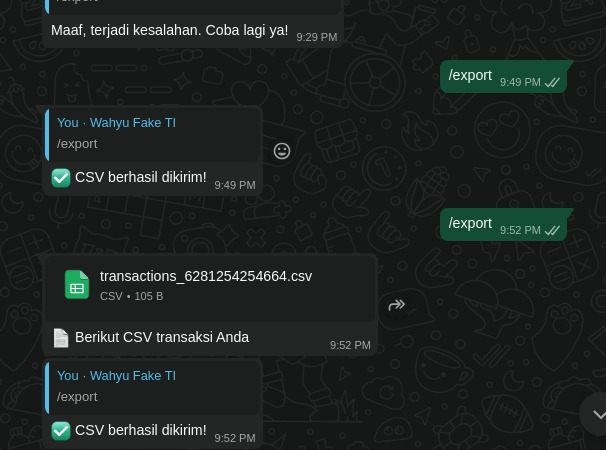
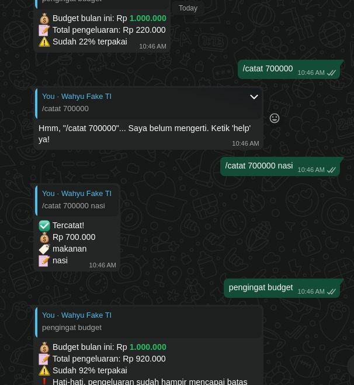
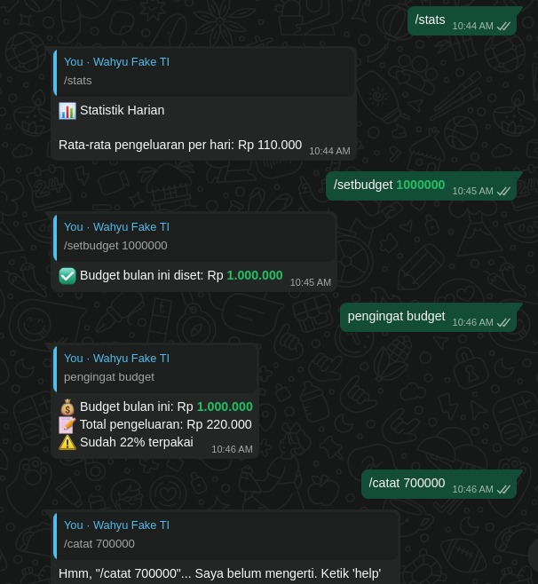
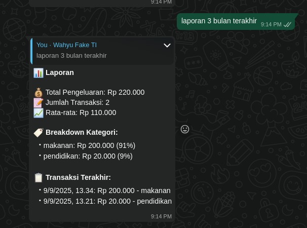
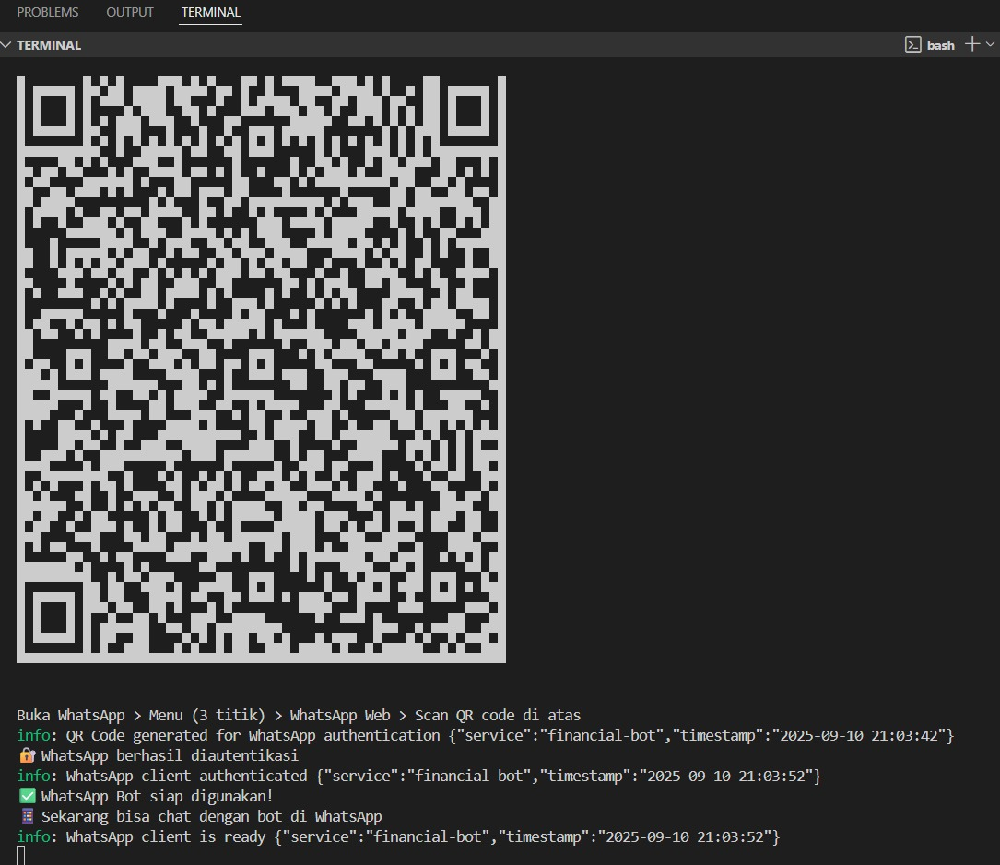
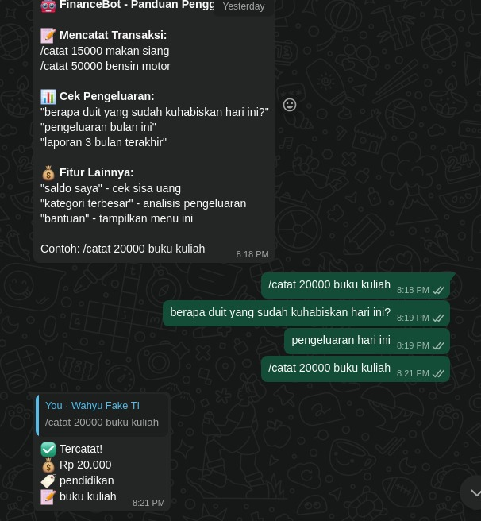

# FinanceBot 💰

**Chatbot WhatsApp untuk mencatat & mengelola keuangan pribadi.**  
Mudah catat transaksi, pantau pengeluaran, dan dapatkan insight finansial langsung dari chat WhatsApp.

---

## ✨ Fitur
- 📝 Catat pengeluaran harian via chat  
- 📊 Laporan harian, bulanan, & custom  
- 🏷️ Kategorisasi otomatis  
- 💰 Set & pantau budget bulanan  
- 📈 Statistik tren pengeluaran  
- 📄 Export ke CSV  
- 🤖 Bahasa Indonesia & Inggris  

---

## 🚀 Instalasi Cepat

### Prasyarat
- Node.js v16+  
- npm / yarn  
- Akun WhatsApp  

### Langkah
```bash
# Clone repo
git clone https://github.com/MFarrelAkbar1/chatbot-finansial-clean

# Install dependencies
npm install

# Setup environment
cp .env.example .env

# Jalankan bot
npm start

```

### Screenshot
---





